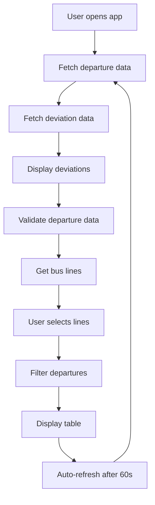

# API Documentation

This document describes the external APIs used by SLussen and the internal application architecture.

## Table of Contents

- [External APIs](#external-apis)
- [Internal Architecture](#internal-architecture)
- [Data Flow](#data-flow)
- [Error Handling](#error-handling)
- [Caching Strategy](#caching-strategy)

## External APIs

SLussen integrates with Stockholm Public Transport (SL) open APIs to fetch real-time transport data.

### SL Transport Integration API

**Base URL**: `https://transport.integration.sl.se/v1/`

#### Departures Endpoint

Fetches real-time departure information for bus stops.

**Endpoint**: `GET /sites/{site}/departures`

**Parameters**:
- `site` (required): Stop ID
- `transport` (optional): Transport type filter (we use "BUS")

**Used Site IDs**:
- `9192`: Slussen (primary)
- `1321`: Slussen (secondary/alternative location)

**Example Request**:
```
GET https://transport.integration.sl.se/v1/sites/9192/departures?transport=BUS
```

**Response Format**:
```json
{
  "departures": [
    {
      "line": {
        "designation": "401",
        "transport_mode": "BUS"
      },
      "destination": "Nacka station",
      "display": "2 min",
      "expected": "2024-01-15T14:32:00.000+01:00",
      "stop_point": {
        "designation": "A",
        "name": "Slussen"
      }
    }
  ]
}
```

**Response Fields**:
- `line.designation`: Bus line number (e.g., "401", "428X")
- `destination`: Final destination of the bus
- `display`: Human-readable departure time
- `expected`: ISO 8601 timestamp of expected departure
- `stop_point.designation`: Platform/stop designation

#### Rate Limiting
- No official rate limits documented
- Application implements 60-second caching to minimize requests
- Uses retry mechanism with exponential backoff for failed requests

### SL Deviations API

**Base URL**: `https://deviations.integration.sl.se/v1/`

#### Messages Endpoint

Fetches traffic disruption and deviation messages.

**Endpoint**: `GET /messages`

**Parameters**:
- `future` (optional): Include future deviations (we use "true")
- `site` (optional): Filter by site ID

**Example Request**:
```
GET https://deviations.integration.sl.se/v1/messages?future=true&site=9192
```

**Response Format**:
```json
[
  {
    "priority": {
      "importance_level": 7,
      "influence_level": 6,
      "urgency_level": 2
    },
    "message_variants": [
      {
        "language": "sv",
        "header": "Störning på linje 401",
        "details": "På grund av trafikstörning kan förseningar uppstå..."
      }
    ]
  }
]
```

**Priority Calculation**:
Priority score = `importance_level × influence_level × urgency_level`
- Only messages with score > 35 are displayed
- Only Swedish language messages are shown

## Internal Architecture

### Application Structure

```
slussen.py
├── Configuration & Constants
├── Utility Functions
├── Data Fetching Layer
├── Data Processing Layer
├── UI Components
└── Main Application Logic
```

### Key Components

#### 1. Configuration Constants

```python
SITES = ["9192", "1321"]           # Stop IDs to query
LINES = {401, 402, ...}            # Monitored bus lines
PRIORITY_THRESHOLD = 35            # Minimum priority for showing deviations
MAX_RETRIES = 3                    # API retry attempts
RETRY_DELAY = 5                    # Seconds between retries
```

#### 2. Data Fetching Functions

**`fetch_data_with_retries(url)`**
- Generic HTTP client with retry logic
- Handles timeouts, HTTP errors, and connection issues
- Implements exponential backoff

**`fetch_departure_data()`**
- Cached function (TTL: 60 seconds)
- Fetches data from multiple sites concurrently
- Returns processed departure list

**`fetch_deviation_data()`**
- Cached function (TTL: 60 seconds)
- Fetches disruption data for all monitored sites
- Filters by priority and language

#### 3. Data Processing Functions

**`parse_departure_data(data)`**
- Filters departures by monitored bus lines
- Determines correct stop point based on line
- Converts timestamps to datetime objects

**`get_stop_point(departure, line_designation)`**
- Maps bus lines to correct stop locations:
  - Glasbruksgatan: 25M, 26M, 423, 449
  - Slussbrogatan: 71T
  - Default: Uses API-provided stop point

**`parse_expected_time(expected_time_str)`**
- Safely parses ISO 8601 timestamps
- Returns None for invalid formats

#### 4. UI Functions

**`display_deviations(deviation_data)`**
- Shows traffic disruptions in expandable section
- Uses error styling for high-priority issues

**`validate_departure_data(departure_data)`**
- Checks if any departures were found
- Stops execution with error message if none

## Data Flow



### Concurrent Data Fetching

The application uses `ThreadPoolExecutor` to fetch data from multiple stops simultaneously:

```python
with ThreadPoolExecutor() as executor:
    results = executor.map(fetch_and_parse, SITES)
```

This reduces total loading time compared to sequential requests.

### Data Transformation Pipeline

1. **Raw API Response** → JSON data from SL APIs
2. **Parse & Filter** → Extract relevant departures for monitored lines
3. **Enrich** → Add stop point information based on line mapping
4. **Sort** → Order by expected departure time
5. **Format** → Convert to UI-friendly format for display

## Error Handling

### API Errors

**Connection Issues**:
- Automatic retry up to 3 attempts
- 5-second delay between retries
- User notification of retry attempts

**HTTP Errors**:
- Logged with specific error codes
- Graceful degradation (empty results)
- User-friendly error messages

**Timeout Handling**:
- 10-second timeout per request
- Retry mechanism for transient issues

### Data Validation

**Missing Keys**:
- Safe dictionary access with `.get()`
- Default values for missing fields
- Warning messages for developers

**Invalid Timestamps**:
- Try/catch for datetime parsing
- Fallback to None for invalid formats
- Sorting handles None values gracefully

### User Experience

**No Data Scenarios**:
- Clear error messages in Swedish
- Guidance for troubleshooting
- Graceful app termination when appropriate

## Caching Strategy

### Streamlit Cache Integration

```python
@st.cache_data(ttl=60)
def fetch_departure_data():
    # Cached for 60 seconds
```

**Benefits**:
- Reduces API calls to SL services
- Improves app performance
- Provides resilience during API outages

**Cache Invalidation**:
- Automatic expiry after 60 seconds
- Manual refresh via "Uppdatera" button
- Cache bypass during development

### Memory Usage

- Minimal memory footprint
- Cache size limited by TTL
- No persistent storage required

## Performance Considerations

### Optimization Strategies

1. **Concurrent API Calls**: Parallel fetching from multiple endpoints
2. **Data Caching**: 60-second TTL reduces redundant requests
3. **Minimal Data Processing**: Only essential transformations
4. **Lazy Loading**: UI updates only when data changes

### Monitoring

**Key Metrics**:
- API response times
- Error rates by endpoint
- Cache hit/miss ratios
- User session duration

**Alerts**:
- Consecutive API failures
- Extended response times
- High error rates

## Security Considerations

### API Access

- No authentication required for SL APIs
- Rate limiting handled through caching
- No sensitive data transmitted

### Data Privacy

- No user data collection
- No persistent storage
- Real-time data only (not historical)

### Network Security

- HTTPS for all API communications
- No user input validation needed (no user input)
- Client-side only application

## Future Enhancements

### Potential API Improvements

1. **WebSocket Integration**: Real-time updates without polling
2. **Additional SL APIs**: Journey planning, service alerts
3. **Geolocation**: Automatic stop detection
4. **Push Notifications**: Browser alerts for delays

### Architecture Improvements

1. **Database Layer**: Store historical data for analytics
2. **API Gateway**: Centralized API management
3. **Microservices**: Separate services for different functions
4. **CDN Integration**: Faster global access

## Troubleshooting

### Common API Issues

**Problem**: `requests.exceptions.HTTPError: 500`
- **Cause**: SL API server error
- **Solution**: Automatic retry, check SL service status

**Problem**: `requests.exceptions.Timeout`
- **Cause**: Slow network or overloaded SL servers
- **Solution**: Increase timeout, implement exponential backoff

**Problem**: Empty departure data
- **Cause**: No buses scheduled, API filtering, or line changes
- **Solution**: Check line configurations, verify stop IDs

### Development Issues

**Problem**: Cache not updating
- **Solution**: Clear Streamlit cache or restart application

**Problem**: Import errors
- **Solution**: Verify all dependencies are installed

For additional support, see the [Contributing Guidelines](CONTRIBUTING.md) or open an issue on GitHub.