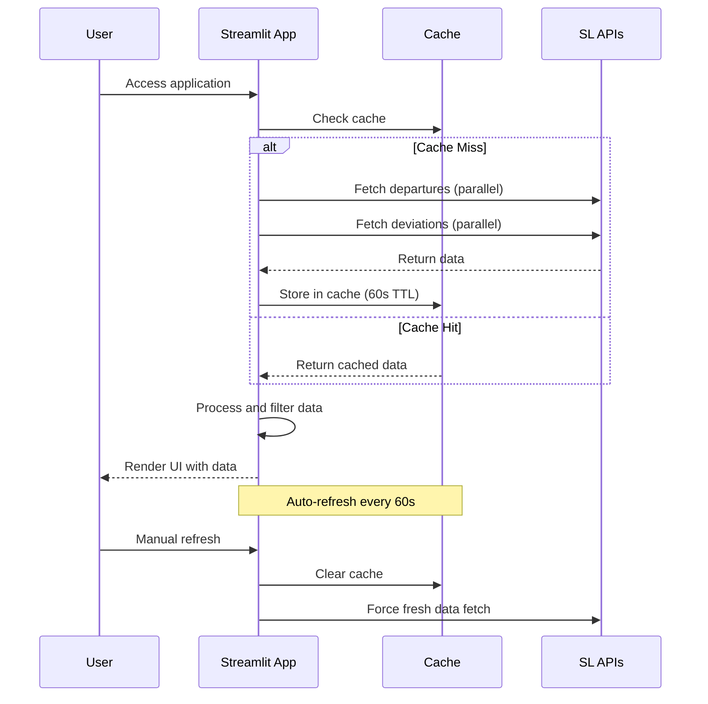

# Architecture Documentation

This document describes the technical architecture and design decisions for the SLussen application.

## Table of Contents

- [Overview](#overview)
- [System Architecture](#system-architecture)
- [Component Design](#component-design)
- [Data Flow](#data-flow)
- [Design Patterns](#design-patterns)
- [Performance Considerations](#performance-considerations)
- [Security Architecture](#security-architecture)
- [Scalability](#scalability)

## Overview

SLussen is a single-page web application built with Streamlit that provides real-time bus departure information. The architecture prioritizes simplicity, reliability, and performance while maintaining clean separation of concerns.

### Key Architectural Principles

1. **Simplicity**: Minimal complexity, easy to understand and maintain
2. **Reliability**: Robust error handling and graceful degradation
3. **Performance**: Efficient data fetching and caching strategies
4. **Separation of Concerns**: Clear boundaries between data, business logic, and presentation
5. **Stateless Design**: No server-side state management required

## System Architecture

```
┌─────────────────┐    ┌─────────────────┐    ┌─────────────────┐
│   Web Browser   │    │   Streamlit     │    │   SL APIs       │
│                 │    │   Application   │    │                 │
│ ┌─────────────┐ │    │ ┌─────────────┐ │    │ ┌─────────────┐ │
│ │ User        │ │◄──►│ │ slussen.py  │ │◄──►│ │ Departures  │ │
│ │ Interface   │ │    │ │             │ │    │ │ API         │ │
│ └─────────────┘ │    │ └─────────────┘ │    │ └─────────────┘ │
│                 │    │                 │    │                 │
│                 │    │ ┌─────────────┐ │    │ ┌─────────────┐ │
│                 │    │ │ Cache Layer │ │    │ │ Deviations  │ │
│                 │    │ │ (Streamlit) │ │    │ │ API         │ │
│                 │    │ └─────────────┘ │    │ └─────────────┘ │
└─────────────────┘    └─────────────────┘    └─────────────────┘
```

### Technology Stack

**Frontend & Backend**:
- **Streamlit**: Web framework providing both UI and server functionality
- **Python 3.8+**: Core programming language

**External Dependencies**:
- **requests**: HTTP client for API communication
- **concurrent.futures**: Parallel processing for API calls
- **datetime**: Time handling and parsing

**External Services**:
- **SL Transport Integration API**: Real-time departure data
- **SL Deviations API**: Traffic disruption information

## Component Design

### Application Structure

```
slussen.py
├── Configuration (Lines 9-58)
│   ├── Constants and settings
│   ├── API endpoints
│   └── Business rules
├── Core Functions (Lines 61-104)
│   ├── Page configuration
│   └── Utility functions
├── Data Layer (Lines 106-199)
│   ├── API communication
│   ├── Data fetching
│   └── Error handling
├── Business Logic (Lines 201-311)
│   ├── Data processing
│   ├── Filtering logic
│   └── Validation
└── Presentation Layer (Lines 313-357)
    ├── UI components
    ├── User interactions
    └── Main application flow
```

### Component Responsibilities

#### 1. Configuration Layer
```python
# Constants defining application behavior
SITES = ["9192", "1321"]           # Bus stops to monitor
LINES = {...}                      # Monitored bus lines
PRIORITY_THRESHOLD = 35            # Disruption filtering
```

**Responsibilities**:
- Centralized configuration management
- Business rule definitions
- API endpoint specifications

#### 2. Data Access Layer
```python
@st.cache_data(ttl=60)
def fetch_departure_data():
    """Fetch and cache departure information"""
```

**Responsibilities**:
- External API communication
- Data caching management
- Error handling and retries
- Concurrent data fetching

#### 3. Business Logic Layer
```python
def parse_departure_data(data):
    """Process raw API data into application format"""
```

**Responsibilities**:
- Data transformation and validation
- Business rule application
- Filtering and sorting logic
- Stop point mapping

#### 4. Presentation Layer
```python
def main():
    """Main application flow and UI rendering"""
```

**Responsibilities**:
- User interface rendering
- User interaction handling
- Application state management
- Error display and user feedback

## Data Flow

### Request-Response Cycle



### Data Transformation Pipeline

```
Raw API Data → Parse → Filter → Enrich → Sort → Format → Display
```

1. **Raw API Data**: JSON responses from SL APIs
2. **Parse**: Extract relevant fields, handle missing data
3. **Filter**: Apply line filtering and validation rules
4. **Enrich**: Add stop point information, format times
5. **Sort**: Order by departure time
6. **Format**: Convert to display-ready format
7. **Display**: Render in Streamlit table

## Design Patterns

### 1. Cache-Aside Pattern

```python
@st.cache_data(ttl=60)
def fetch_departure_data():
    # Check cache first, fetch from API if miss
    # Store result in cache for future requests
```

**Benefits**:
- Reduced API calls
- Improved performance
- Automatic cache invalidation

### 2. Concurrent Execution Pattern

```python
with ThreadPoolExecutor() as executor:
    results = executor.map(fetch_and_parse, SITES)
```

**Benefits**:
- Parallel API calls
- Reduced total loading time
- Better resource utilization

### 3. Retry Pattern with Exponential Backoff

```python
for attempt in range(1, MAX_RETRIES + 1):
    try:
        # API call
        break
    except Exception:
        time.sleep(RETRY_DELAY)
```

**Benefits**:
- Resilience to transient failures
- Graceful degradation
- Improved reliability

### 4. Strategy Pattern for Stop Mapping

```python
def get_stop_point(departure, line_designation):
    if line_designation in LINES_GLASBRUKSGATAN:
        return "Glasbruksgatan"
    elif line_designation in LINES_SLUSSBROGATAN:
        return stop_point + " (Slussbrogatan)"
    return stop_point
```

**Benefits**:
- Flexible business rules
- Easy to extend for new lines
- Separation of mapping logic

## Performance Considerations

### Caching Strategy

**Cache Levels**:
1. **Streamlit Cache**: In-memory application cache (60s TTL)
2. **Browser Cache**: HTTP headers for static resources
3. **CDN Cache**: If deployed with CDN (future consideration)

**Cache Optimization**:
- Aggressive caching for relatively static data
- Short TTL to balance freshness vs performance
- Cache warming strategies for first-time users

### Concurrent Processing

**API Call Optimization**:
- Parallel fetching from multiple endpoints
- ThreadPoolExecutor for I/O-bound operations
- Timeout handling to prevent hanging requests

**Performance Metrics**:
- Target: < 3 seconds total page load time
- API response time: < 2 seconds per endpoint
- Cache hit rate: > 80% after initial load

### Memory Management

**Memory Efficiency**:
- Minimal data structures
- Garbage collection friendly patterns
- No persistent state beyond cache

## Security Architecture

### Data Security

**No Sensitive Data**:
- No user authentication required
- No personal data collection
- No data persistence beyond caching

**API Security**:
- Public APIs with no authentication
- Rate limiting through caching
- HTTPS for all external communications

### Application Security

**Input Validation**:
- No user input acceptance (view-only application)
- Robust parsing of external API data
- Safe error handling

**Runtime Security**:
- Minimal attack surface
- No file system access
- Sandboxed execution environment

## Scalability

### Horizontal Scaling

**Stateless Design**:
- No server-side session state
- Cache can be replicated or shared
- Load balancer friendly

**Scaling Strategies**:
1. **Multiple Instances**: Deploy identical copies behind load balancer
2. **Shared Cache**: Redis or similar for shared caching layer
3. **API Gateway**: Centralized API management and rate limiting

### Vertical Scaling

**Resource Requirements**:
- **CPU**: 1 vCPU sufficient for moderate load
- **Memory**: 512MB base + cache overhead
- **Network**: Bandwidth dependent on user count

**Bottlenecks**:
- External API response times
- Streamlit framework overhead
- Memory usage from cache accumulation

### Performance Monitoring

**Key Metrics**:
- Response time percentiles (P50, P95, P99)
- Error rates by component
- Cache hit/miss ratios
- External API latency

**Alerting Thresholds**:
- Response time > 5 seconds
- Error rate > 5%
- Cache hit rate < 70%
- External API failures > 3 consecutive

## Future Architecture Considerations

### Microservices Evolution

**Potential Decomposition**:
```
Current Monolith → Data Service + UI Service + Cache Service
```

**Benefits**:
- Independent scaling
- Technology diversity
- Fault isolation

### Real-time Architecture

**WebSocket Integration**:
- Real-time data push
- Reduced polling overhead
- Better user experience

**Event-Driven Design**:
- Reactive updates
- Decoupled components
- Better scalability

### Cloud-Native Patterns

**Containerization**:
- Docker for deployment consistency
- Kubernetes for orchestration
- Auto-scaling capabilities

**Observability**:
- Distributed tracing
- Centralized logging
- Metrics collection

---

This architecture documentation serves as a reference for developers working on SLussen. For implementation details, see the source code and [API Documentation](API.md).